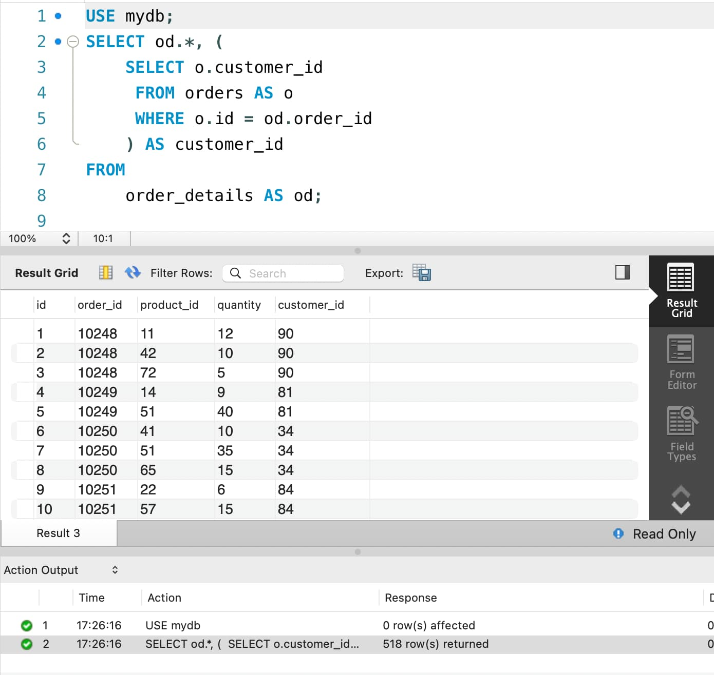
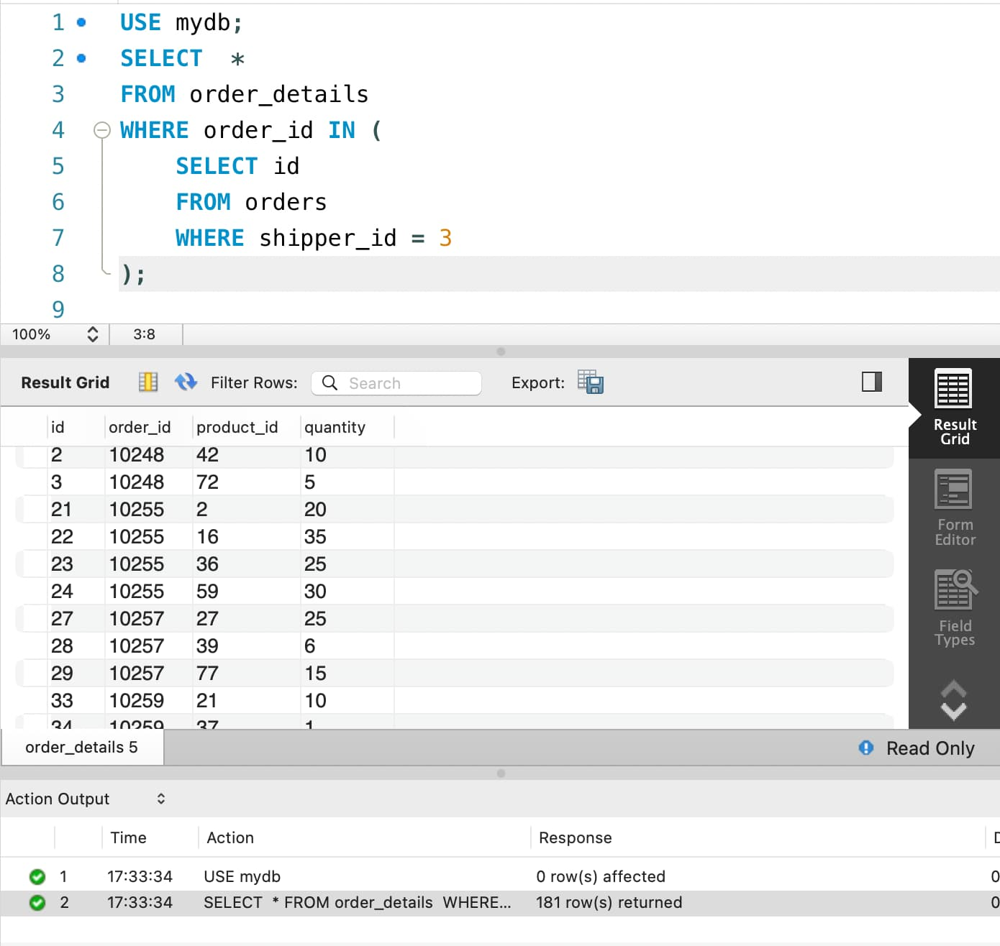
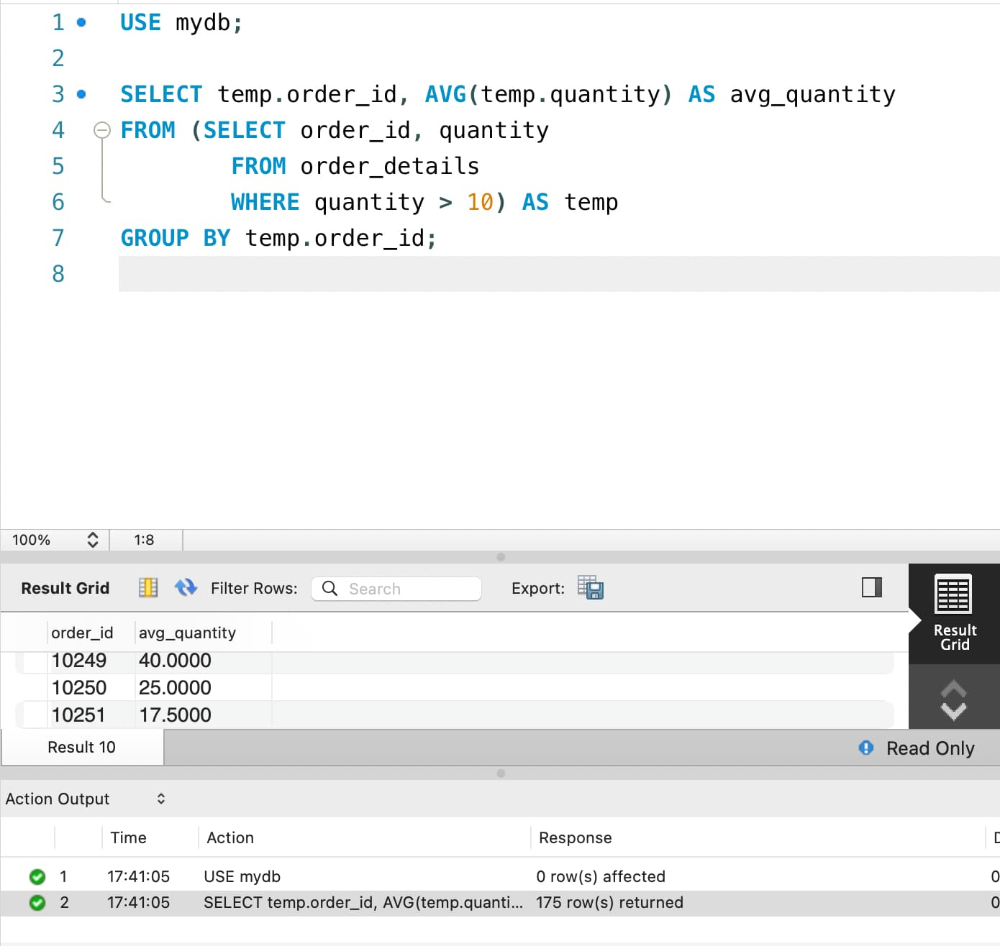
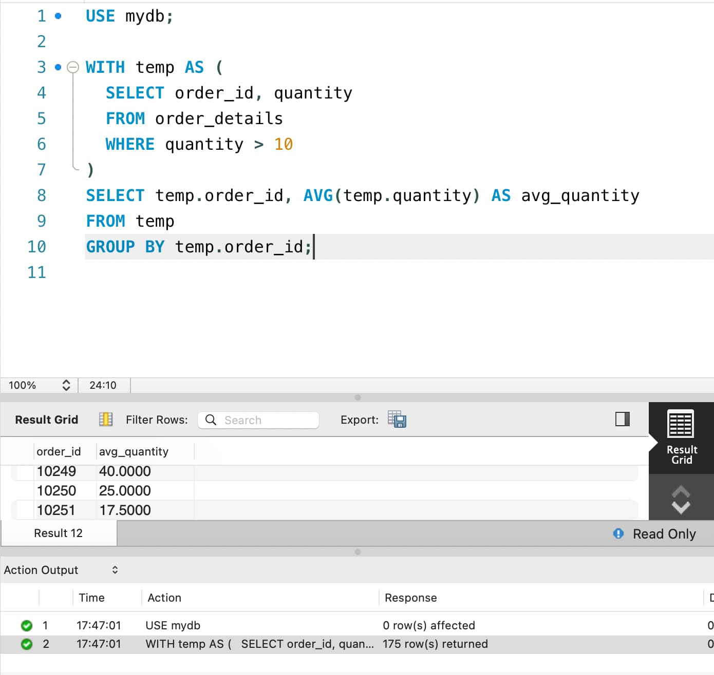
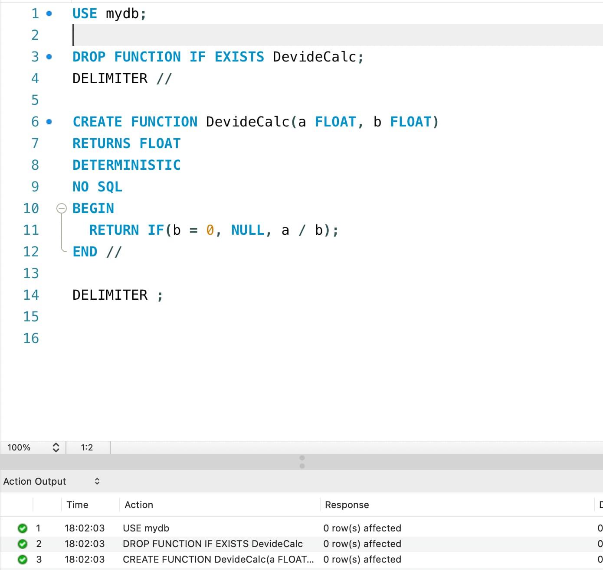

# goit-rdb-hw-05

**#1**

```
SELECT od.*, (
  SELECT o.customer_id 
  FROM orders AS o 
  WHERE o.id = od.order_id
) AS customer_id
FROM order_details AS od;
```

<details>
  <summary>Screenshot</summary>



</details>

**#2**

```
SELECT *
FROM order_details 
WHERE order_id IN (
  SELECT id 
  FROM orders  
  WHERE shipper_id = 3
);
```

<details>
  <summary>Screenshot</summary>



</details>

**#3**

```
SELECT temp.order_id, AVG(temp.quantity) AS avg_quantity
FROM (
  SELECT order_id, quantity
  FROM order_details
  WHERE quantity > 10
) AS temp
GROUP BY temp.order_id;
```

<details>
  <summary>Screenshot</summary>



</details>

**#4**

```
WITH temp AS (
  SELECT order_id, quantity
  FROM order_details
  WHERE quantity > 10
)
SELECT temp.order_id, AVG(temp.quantity) AS avg_quantity
FROM temp
GROUP BY temp.order_id;
```

<details>
  <summary>Screenshot</summary>



</details>

**#5**

```
DROP FUNCTION IF EXISTS DevideCalc;
DELIMITER //

CREATE FUNCTION DevideCalc(a FLOAT, b FLOAT)
RETURNS FLOAT
DETERMINISTIC 
NO SQL
BEGIN
  RETURN IF(b = 0, NULL, a / b);
END //

DELIMITER ;
```

<details>
  <summary>Screenshot</summary>



</details>